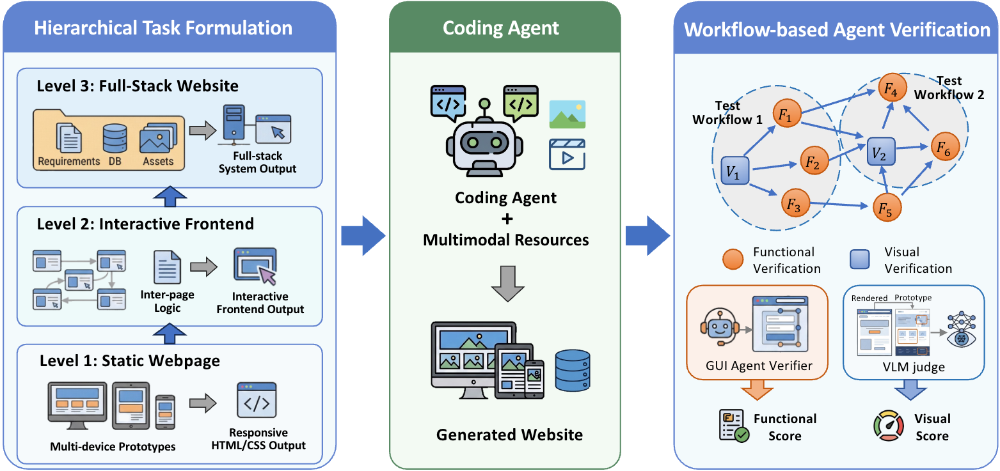
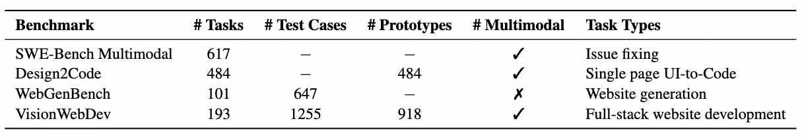
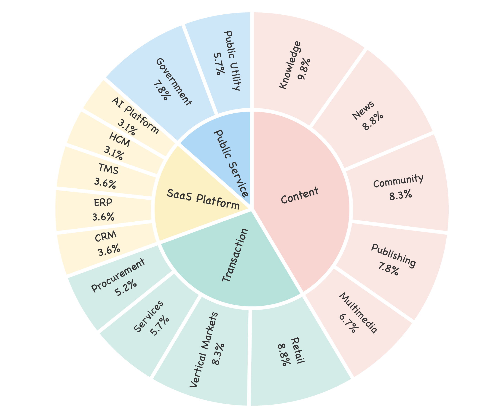
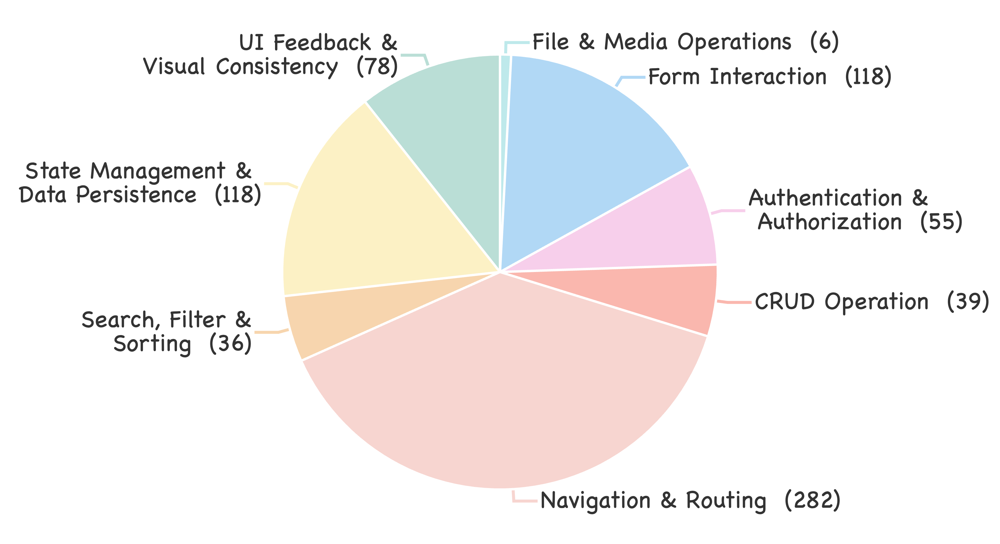
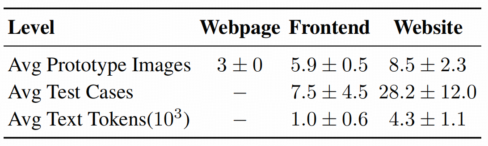
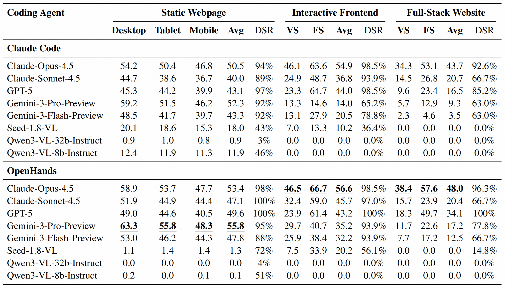
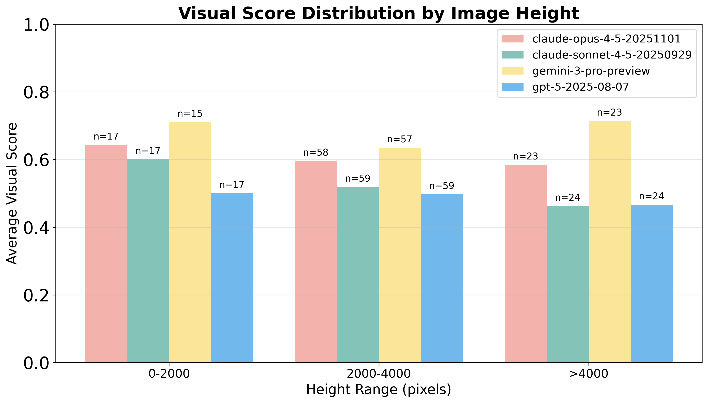
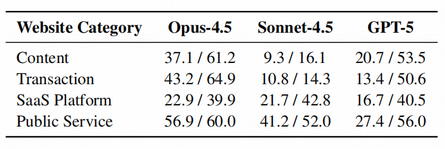
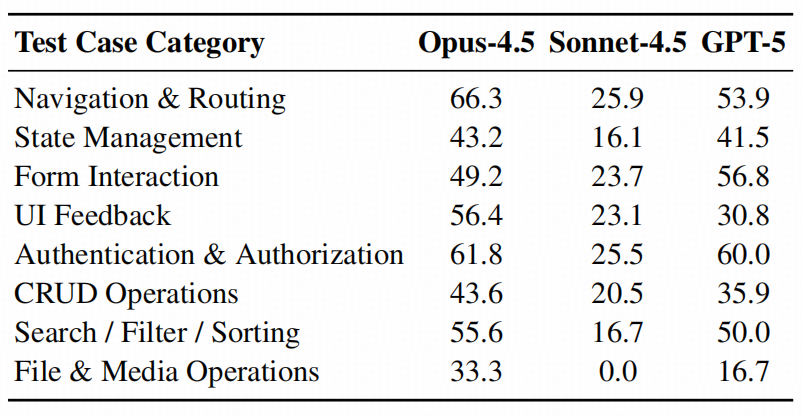

# Vision2Web: A Hierarchical Benchmark for Visual Website Development with Agent Verification


<div align='center'>

[[🏠 Project Page](https://vision2web-bench.github.io/)] [[📖 arXiv Paper](https://arxiv.org/abs/2603.26648)] [[📊 Dataset](https://huggingface.co/datasets/zai-org/Vision2Web)] [[📮 Submit Results](https://huggingface.co/datasets/zai-org/Vision2Web-Leaderboard)]

</div>

<p align="center">
    
</p>

Vision2Web is a comprehensive benchmark designed to evaluate multimodal coding agents on visual website development tasks spanning the full software development lifecycle.

---

## 🔥 News

* **`2026.03.30`** 🌟 We released Vision2Web with comprehensive evaluation tools and leaderboard!

## 👀 Introduction to Vision2Web

Vision2Web is a hierarchical benchmark for evaluating multimodal coding agents on end-to-end visual website development, measuring their ability to integrate UI understanding, requirements reasoning, interactive logic, and full-stack implementation in long-horizon scenarios.

<p align="center">
  
</p>

The benchmark is organized into three progressive levels:

- **Level 1 – Static Webpage:** Generate responsive, executable webpages from multi-device UI prototypes (desktop / tablet / mobile).  
  *Metric:* Visual Score (VS)

- **Level 2 – Interactive Frontend:** Develop multi-page interactive frontends with coherent navigation flows from multiple prototypes and textual specifications.  
  *Metrics:* Visual Score (VS) + Functional Score (FS)

- **Level 3 – Full-Stack Website:** Build complete full-stack systems from structured requirement documents and visual prototypes, handling state management and backend logic.  
  *Metrics:* Visual Score (VS) + Functional Score (FS)

Evaluation is conducted via a workflow-based agent verification paradigm that combines GUI agent verifiers for functional correctness and VLM-based judges for visual fidelity, enabling scalable and implementation-agnostic assessment across increasing levels of complexity.

---

## 📊 Benchmark Statistics

Vision2Web comprises **193 tasks** spanning 16 subcategories across 4 major domains (E-Commerce, SaaS, Content, and Public Service), supported by **918 prototype images** and **1,256 functional test cases**.

<table align="center">
<tr>
<td align="center" width="50%">
  
</td>

<td align="center" width="50%">
  <br/><br/>
  
</td>
</tr>
</table>


## 📥 Dataset

### License

Vision2Web is licensed under CC-BY-NC-SA-4.0 and is intended for academic research only. Commercial use in any form is prohibited.

### Download

The dataset is organized in the following structure:

```
datasets/
├── webpage/              # Level 1: Static Webpage (100 tasks)
├── frontend/             # Level 2: Interactive Frontend (66 tasks)
└── website/              # Level 3: Full-Stack Website (27 tasks)
```

Each task directory contains:
- `prototypes/`: UI prototype images (desktop/tablet/mobile)
- `resources/`: Multimedia assets (images, icons, videos, fonts)
- `workflow.json`: Test workflow specification
- `prompt.txt`: Textual requirements (Level 2 only)
- `prd.md`: Requirement Document (Level 3 only)

## 🚀 Installation

### Prerequisites

- Python 3.8+
- Docker

### Install Vision2Web

```bash
# Clone repository
git clone https://github.com/zai-org/Vision2Web.git
cd Vision2Web

# Install package
pip install -e .
```

## 🔧 Quick Start

### Step 1: Build Docker Sandbox

The Docker sandbox provides isolated environments for running inference and evaluation:

```bash
cd docker
bash build.sh
```

This builds the `vision2web-sandbox:latest` image with all necessary dependencies.

### Step 2: Configure LiteLLM Proxy (Recommended)

For consistent model routing and API compatibility, we recommend using [LiteLLM](https://github.com/BerriAI/litellm) as a proxy:

```bash
# Install LiteLLM
pip install litellm[proxy]

# Start LiteLLM proxy with your configuration
litellm --config litellm_config.yaml
```

**For Claude Code**: When using the Claude Code framework, we route all claude-* model identifiers to the target evaluation model via the LiteLLM proxy.


### Step 3: Run Inference

Execute inference to generate project implementations:

```bash
bash scripts/run_inference.sh
```

**Key Parameters**:
- `--framework`: Agent framework (`claude_code` or `openhands`)
- `--model`: Model identifier (should match LiteLLM configuration)
- `--base-url`: API base URL (use LiteLLM proxy endpoint)
- `--task`: Task type filter (`webpage`, `frontend`, or `website`)
- `--projects`: Specific project names to run (optional)
- `--max-workers`: Number of concurrent inference tasks

**Results Structure**:
```
results/
└── webpage|frontend|website/
    └── framework/
        └── model/
            └── project_name/
                ├── start.sh              # Deployment script
                ├── prototypes/           # Copied prototypes
                └── resources/            # Copied resources
```

### Step 4: Run Evaluation

After inference completes, run automated evaluation:

```bash
bash scripts/run_evaluation.sh
```

Or use the CLI with separate models for different evaluation tasks:

**Key Parameters**:
- `--gui-agent-model`: Model for GUI testing agent (executes test workflows)
- `--vlm-judge-model`: Model for visual prototype comparison
- `--model`: Filter for inference model results to evaluate
- `--framework`: Filter for framework results to evaluate
- `--task`: Filter for task type to evaluate

**Evaluation Outputs**:
```
project_name/
└── test_results/
    ├── workflow_i/
    │   └── test_case_i/
    │       ├── result.json
    │       └── screenshots/
    └── prototypes/
        ├── desktop_actual.jpg
        └── desktop_scores.json
```

### Step 5: Analyze Results

Generate summary statistics and visualizations:

```bash
bash scripts/run_analysis.sh
```

### Step 6: Submit Leaderboard Results

You can run evaluation locally to test your agent's performance. **Official leaderboard scores are evaluated by the maintainers** using the latest VLM Judge and GUI Agent.

To submit to the leaderboard, you only need to submit your **inference outputs**. Please follow the submission guidelines in the [leaderboard repository](https://huggingface.co/datasets/zai-org/Vision2Web-Leaderboard).

## 📊 Experimental Results
- Overall Performance
<p align="center">
    
</p>

- Performance across Page Size
<p align="center">
    
</p>

- Performance across Task Categories
<p align="center">
    
</p>

- Performance across Test Cases
<p align="center">
    
</p>

## ✒️ Citation

If you find Vision2Web helpful for your research, please consider citing:

```bibtex
@misc{he2026vision2webhierarchicalbenchmarkvisual,
      title={Vision2Web: A Hierarchical Benchmark for Visual Website Development with Agent Verification},
      author={Zehai He and Wenyi Hong and Zhen Yang and Ziyang Pan and Mingdao Liu and Xiaotao Gu and Jie Tang},
      year={2026},
      eprint={2603.26648},
      archivePrefix={arXiv},
      primaryClass={cs.SE},
      url={https://arxiv.org/abs/2603.26648},
}
```
